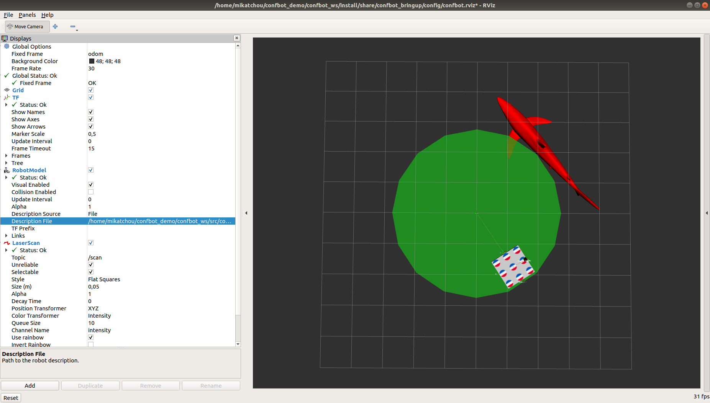

# How to run the demo

## Prerequisites

- Have ROS 2 (`ros_core`) installed, here assumed ROS Dashing located at `/opt/ros/dashing`
- ROS 2 development tools (`sudo apt install python3-colcon-common-extensions python3-rosdep`)

### Source dashing environment
```bash
source /opt/ros/dashing/setup.bash
```

## Getting and building the code

```bash
export CONFBOT_WS=$HOME/confbot_demo/confbot_ws
mkdir -p $CONFBOT_WS/src && cd $CONFBOT_WS && git clone https://github.com/Karsten1987/roscon2018 src/roscon2018
```
To make the rest of the demo easier we recommend you to place this export in your `.bashrc`
```
echo "export CONFBOT_WS=$HOME/confbot_demo/confbot_ws" >> ~/.bashrc
```

### Adapting the code for your machine
```bash
cd $CONFBOT_WS
sed -i s@/Users/karsten/workspace/osrf/roscon2018_ws/@$CONFBOT_WS/@g `grep -lr "/karsten/"  --exclude Linux_Tutorial.md`
```

### Installing the dependencies
```bash
sudo rosdep init
rosdep update
rosdep install -y --from-paths src --ignore-src
```

### Build the workspace
```bash
colcon build --merge-install --cmake-args --no-warn-unused-cli -DSECURITY=ON -DBUILD_TESTING=OFF
```

### Install extra ROS tools used in the tutorial
```bash
sudo apt-get install -y \
  ros-$ROS_DISTRO-ros-core \
  ros-$ROS_DISTRO-ros2bag \
  ros-$ROS_DISTRO-rosbag2 \
  ros-$ROS_DISTRO-rosbag2-converter-default-plugins \
  ros-$ROS_DISTRO-rosbag2-storage-default-plugins \
  ros-$ROS_DISTRO-rqt-graph \
  ros-$ROS_DISTRO-rqt-image-view \
  ros-$ROS_DISTRO-rqt-plot \
  ros-$ROS_DISTRO-rqt-publisher \
  ros-$ROS_DISTRO-rqt-service-caller \
  ros-$ROS_DISTRO-rviz2
```


## Run the demo
In each terminal from now on, always assume use a sourced environment:
```bash
source $CONFBOT_WS/install/setup.bash
```
You can also add it to your .bashrc for convenience
```bash
echo "source $CONFBOT_WS/install/setup.bash" >> ~/.bashrc
```


### Launch the demo
Terminal 1:
```bash
ros2 launch confbot_bringup confbot_bringup.launch.py
```

### Use CLI to introspect and interact with the system

#### Introspect the system
Terminal 2:
```bash
$ ros2 node list
/launch_ros
/robot_state_publisher
/safe_zone_publisher
/confbot_driver_container
/confbot_driver
/twist_publisher
/confbot_sensors_container
/confbot_laser
/static_tf_wheel_left
/static_tf_wheel_right
/static_tf_caster_wheel_front
/static_tf_caster_wheel_rear
```

```bash
$ ros2 topic list -t

/cmd_vel [geometry_msgs/Twist]
/confbot_laser/transition_event [lifecycle_msgs/TransitionEvent]
/danger_zone [visualization_msgs/Marker]
/joint_states [sensor_msgs/JointState]
/parameter_events [rcl_interfaces/ParameterEvent]
/robot_description [std_msgs/String]
/rosout [rcl_interfaces/Log]
/safe_zone [visualization_msgs/Marker]
/tf [tf2_msgs/TFMessage]
/tf_static [tf2_msgs/TFMessage]
```

```bash
$ ros2 topic echo /cmd_vel

linear:
  x: 0.10000000149011612
  y: 0.0
  z: 0.0
angular:
  x: 0.0
  y: 0.0
  z: 0.10000000149011612
---
linear:
  x: 0.10000000149011612
  y: 0.0
  z: 0.0
angular:
  x: 0.0
  y: 0.0
  z: 0.10000000149011612
---
^C
```


#### Visualize the data
Terminal 2:
```bash
ros2 run rviz2 rviz2 -d `ros2 pkg prefix confbot_bringup --share`/config/confbot.rviz
```



Terminal 3:
Leverage `rqt_graph` to inspect the ROS node graph
```bash
ros2 run rqt_gui rqt_gui --perspective-file `ros2 pkg prefix confbot_bringup --share`/config/confbot_bringup_qt.perspective
```
Hit the refresh button to actualize the graph.


#### Set parameters
Terminal 3:
The node `/twist_publisher` has a speed parameter.
```bash
$ ros2 param list /twist_publisher
  speed
  use_sim_time
```

We can check it's initial value:
```bash
$ ros2 param get /twist_publisher speed
Double value is: 0.10000000149011612
```

Let's try to increase the speed of our robot by setting the parameter to 0.2.
```bash
$ ros2 param set /twist_publisher speed 0.2
Set parameter successful
```

<!--
In Terminal 1 we see:
```bash
# TODO this is not printed anymore ?
# Oh actually the console output is batched printed and this didnt get printed until the end of the action tutorial...
[INFO] [twist_publisher]: set parameter 'speed' to "0.200000"
```
-->

In RViz: robot goes twice as fast

Terminal 3:
```bash
$ ros2 param get /twist_publisher speed
Double value is: 0.2
$ ros2 param set /twist_publisher speed 0.1
Set parameter successful
$ ros2 param get /twist_publisher speed
Double value is: 0.1

```

#### Introspecting lifecycle nodes

Terminal 3:
```bash
$ ros2 lifecycle nodes
/confbot_laser
```

```bash
$ ros2 lifecycle list /confbot_laser
- configure [1]
	Start: unconfigured
	Goal: configuring
- shutdown [5]
	Start: unconfigured
	Goal: shuttingdown
```

```bash
$ ros2 lifecycle set /confbot_laser 1
Transitioning successful
```

```bash
$ ros2 lifecycle list /confbot_laser
- cleanup [2]
	Start: inactive
	Goal: cleaningup
- activate [3]
	Start: inactive
	Goal: activating
- shutdown [6]
	Start: inactive
	Goal: shuttingdown
```

```bash
$ ros2 lifecycle set /confbot_laser 3
```
In RViz: the laser node is now publishing fake laser data!


### Using components

Terminal 3:
Listing running components:
```bash
$ ros2 component list
/confbot_driver_container
  1  /confbot_driver
  2  /twist_publisher
```

Unload the `twist_publisher` component:
```bash
$ ros2 component unload /confbot_driver_container 2
Unloaded component 2 from '/confbot_driver_container' container node
```
In RViz the robot stops moving

List available components:
```bash
$ ros2 component types
confbot_sensors
  confbot_sensors::nodes::ConfbotLaser
confbot_driver
  confbot_driver::nodes::ConfbotDriver
  confbot_driver::nodes::TwistPublisher
```

Load a component:
```bash
$ ros2 component load /confbot_driver_container confbot_driver confbot_driver::nodes::TwistPublisher
Loaded component 3 into '/confbot_driver_container' container node as '/twist_publisher'
```
Robot starts moving again in RViz

```bash
$ ros2 component list
/confbot_driver_container
  1  /confbot_driver
  3  /twist_publisher
/confbot_sensors_container
  1  /confbot_laser
```

### Using ROS action server/client
In the example above, the robot got moved around by sending velocity commands on a specific topic called `/cmd_vel`.
This makes sense when considering the twist publisher being a joystick, where commands shall be sent to the robot as long as the joystick buttons are pressed.

However, one can think of another example such as a navigation goal, where the robot is directed to move for a certain amount of time with a specific velocity.
For this use case, we introduced an action server where we can asynchronously send a single command to the robot and periodically ask for feedback of its state.
In order for this to visualize properly, we want to shutdown the twist publisher first.
```bash
$ ros2 component unload /confbot_driver_container 3
```

Next, we provide an already prepared executable which sends an action goal to the robot (drive in circle for 10 seconds) and then asks for the current robot state until the action is finished.
```bash
$ ros2 run confbot_driver confbot_actionclient
```

As you can see on the terminal output, we can get information about the current state:
```bash
[INFO] [confbot_actionclient]: Sending goal
[INFO] [confbot_actionclient]: Waiting for result
[INFO] [confbot_actionclient]: Confbot traveled 0.100000 so far in 0 seconds
...
[INFO] [confbot_actionclient]: Confbot traveled 10.000002 so far in 9 seconds
[INFO] [confbot_actionclient]: result received
[INFO] [confbot_actionclient]: robot traveled 10.100002 meters
```

There further exists a command line tool which allows to send the same goal without the need of an executable.
```bash
ros2 action send_goal /move_command confbot_msgs/action/MoveCommand "{duration: {sec: 10}, linear_velocity: 0.1, angular_velocity: 0.1}"
Waiting for an action server to become available...
Sending goal:
     duration:
  sec: 10
  nanosec: 0
linear_velocity: 0.1
angular_velocity: 0.1

Goal accepted with ID: 128044c1ecaa46d287941597273fcdb7

Result:
    distance_traveled: 10.000001907348633

Goal finished with status: SUCCEEDED
```
Optionaly we can print the feedback message using the `--feedback` flag.

Let's start our twist_publisher component again before experimetning with rosbags
```bash
$ ros2 component load /confbot_driver_container confbot_driver confbot_driver::nodes::TwistPublisher
Loaded component 4 into '/confbot_driver_container' container node as '/twist_publisher'
```

### Working with rosbags

Starting from Dashing, rosbag2 is available and can be used to record and replay ros2 topics.
For our demo, we are going to record the `cmd_vel` topic and replay it afterwards.
The user is encouraged to follow the steps below, but for completeness, we provided already pre-recorded bag files in the `confbot_driver/resources` folder.
It is important to make sure that the `twist_publisher` node is currently running and correctly publishing data on the `cmd_vel` topic.


```bash
cd $CONFBOT_WS
ros2 bag record -o ros2_cmd_vel_bag /cmd_vel
[INFO] [rosbag2_storage]: Opened database 'ros2_cmd_vel_bag'.
[INFO] [rosbag2_transport]: Listening for topics...
[INFO] [rosbag2_transport]: Subscribed to topic '/cmd_vel'
[INFO] [rosbag2_transport]: All requested topics are subscribed. Stopping discovery...
^C[INFO] [rclcpp]: signal_handler(signal_value=2)
```
The command above records all incoming data on the `cmd_vel` topic.
We can use the rosbag command line tool to introspect our recording:

```bash
ros2 bag info ros2_cmd_vel_bag

Files:             ros2_cmd_vel_bag.db3
Bag size:          56.4 KiB
Storage id:        sqlite3
Duration:          6.897s
Start:             Jun  4 2019 22:33:28.963 (1559712808.963)
End                Jun  4 2019 22:33:35.861 (1559712815.861)
Messages:          70
Topic information: Topic: /cmd_vel | Type: geometry_msgs/msg/Twist | Count: 70 | Serialization Format: cdr
```

Before replaying our `ros2_cmd_vel_bag` bagfile, we have to stop the `twist_publisher` to make sure we don't have two nodes publishing on the `cmd_vel` topic simultaneously.
In our demo, the twist publisher is loaded under the `/confbot_driver_container` with ID 2 as shown above.

```bash
ros2 component unload /confbot_driver_container 4
Unloaded component 4 from '/confbot_driver_container' container node
```

With the twist publisher stopped, you can see that the robot does not move any longer in RViz.
The next step is now to replay the bagfile:
```bash
ros2 bag play ros2_cmd_vel_bag
[INFO] [rosbag2_storage]: Opened database 'ros2_cmd_vel_bag'.
```
While the bag file is playing, our confbot robot moves again in RViz until the bag file is completely replayed.

#### Replaying legacy ROS 1 bag files

For further demo purposes, you can find a legacy ROS 1 bag file in `confbot_driver/resources`.
The current rosbag2 implementation provides plugins which allow to replay - and replay only - existing legacy ROS 1 bag files.
Needless to say, this requires a parallel ROS 1 melodic installation and thus only works on Linux 18.04.

##### Install the plugin

First, you will need to make sure to have the ROS 1 repositories in your sources:

[Set up your sources.list](http://wiki.ros.org/melodic/Installation/Ubuntu#Installation.2BAC8-Ubuntu.2BAC8-Sources.Setup_your_sources.list)

[Set up your keys](http://wiki.ros.org/melodic/Installation/Ubuntu#Installation.2BAC8-Ubuntu.2BAC8-Sources.Set_up_your_keys)

```bash
sudo apt install -y ros-dashing-rosbag2-bag-v2-plugins
```

##### Use the plugin

In a fresh terminal:
```bash
source /opt/ros/melodic/setup.bash
cd $CONFBOT_WS/src/roscon2018/confbot_driver/resources
rosbag info ros1_cmd_vel.bag
```
You can see that this is a ROS1 rosbag as usual.
When specifying the plugin for reading legacy rosbags in ROS2, we can load the same information in ROS:
```bash
source /opt/ros/melodic/setup.bash
source /opt/ros/dashing/setup.bash
cd $CONFBOT_WS/src/roscon2018/confbot_driver/resources
ros2 bag info -s rosbag_v2 ros1_cmd_vel.bag
```
The ROS 1 bag file can be replayed with almost the same command above:
```bash
ros2 bag play -s rosbag_v2 ros1_cmd_vel.bag
```
That will just as before publish data on the `cmd_vel` topic and the robot moves again.
However, the data is actually coming from an old ROS 1 bag file.


### Use ROS 2 security

Let's start our `twist_publisher` once again:
```bash
ros2 component load /confbot_driver_container confbot_driver confbot_driver::nodes::TwistPublisher
```

#### Prerequisite: Compromise the system

Terminal 3:
Tempering with the system:
```
ros2 topic pub /cmd_vel geometry_msgs/Twist "{linear: {x: -0.5}, angular: {z: -0.5}}" -r 10
```
Robot now goes backward in RViz.
If you command the robot in a non-circular motion, the robot will eventually move out of its safe zone and gets eaten by the shark!
We definitely want to secure our little poor confbot :)

Please make sur to terminate all the running nodes by Ctrl+C them (Terminals 1, 2 and 3).

We will now use ROS2 Security to harden the system.

#### Create security artifacts

In a new terminal
```bash
export ROS_SECURITY_ROOT_DIRECTORY=$CONFBOT_WS/confbot_keystore
source /opt/ros/dashing/setup.bash
cd $CONFBOT_WS
colcon build --merge-install --cmake-args -DSECURITY=ON -DPOLICY_FILE=$CONFBOT_WS/src/roscon2018/confbot_security/safe_zone_publisher_policies.xml --packages-select confbot_security --cmake-force-configure
```

The `confbot_keystore` directory content will look similar to:

```bash
/tmp/confbot_ws/confbot_keystore
├── 1000.pem
├── 1001.pem
├── 1002.pem
├── 1003.pem
├── 1004.pem
├── 1005.pem
├── 1006.pem
├── ca.cert.pem
├── ca_conf.cnf
├── ca.key.pem
├── confbot_driver
│   ├── cert.pem
│   ├── ecdsaparam
│   ├── governance.p7s
│   ├── identity_ca.cert.pem
│   ├── key.pem
│   ├── permissions_ca.cert.pem
│   ├── permissions.p7s
│   ├── permissions.xml
│   ├── req.pem
│   └── request.cnf
├── confbot_laser
│   ├── cert.pem
│   ├── ecdsaparam
│   ├── governance.p7s
│   ├── identity_ca.cert.pem
│   ├── key.pem
│   ├── permissions_ca.cert.pem
│   ├── permissions.p7s
│   ├── permissions.xml
│   ├── req.pem
│   └── request.cnf
├── ecdsaparam
├── governance.p7s
├── governance.xml
├── index.txt
├── index.txt.attr
├── index.txt.attr.old
├── index.txt.old
├── launch_ros
│   ├── cert.pem
│   ├── ecdsaparam
│   ├── governance.p7s
│   ├── identity_ca.cert.pem
│   ├── key.pem
│   ├── permissions_ca.cert.pem
│   ├── permissions.p7s
│   ├── permissions.xml
│   ├── req.pem
│   └── request.cnf
├── robot_state_publisher
│   ├── cert.pem
│   ├── ecdsaparam
│   ├── governance.p7s
│   ├── identity_ca.cert.pem
│   ├── key.pem
│   ├── permissions_ca.cert.pem
│   ├── permissions.p7s
│   ├── permissions.xml
│   ├── req.pem
│   └── request.cnf
├── rviz
│   ├── cert.pem
│   ├── ecdsaparam
│   ├── governance.p7s
│   ├── identity_ca.cert.pem
│   ├── key.pem
│   ├── permissions_ca.cert.pem
│   ├── permissions.p7s
│   ├── permissions.xml
│   ├── req.pem
│   └── request.cnf
├── safe_zone_publisher
│   ├── cert.pem
│   ├── ecdsaparam
│   ├── governance.p7s
│   ├── identity_ca.cert.pem
│   ├── key.pem
│   ├── permissions_ca.cert.pem
│   ├── permissions.p7s
│   ├── permissions.xml
│   ├── req.pem
│   └── request.cnf
├── serial
├── serial.old
└── twist_publisher
    ├── cert.pem
    ├── ecdsaparam
    ├── governance.p7s
    ├── identity_ca.cert.pem
    ├── key.pem
    ├── permissions_ca.cert.pem
    ├── permissions.p7s
    ├── permissions.xml
    ├── req.pem
    └── request.cnf
```

This means only the following nodes have been allowed to be used in a secured environment:
 - /confbot_driver
 - /confbot_driver_container
 - /confbot_laser
 - /confbot_sensors_container
 - /launch_ros
 - /robot_state_publisher
 - /rviz

#### Launch the demo in secure mode

All terminals are assumed to have the environment setup and security environment variables set
```bash
source $CONFBOT_WS/install/setup.bash
export ROS_SECURITY_ENABLE=true
export ROS_SECURITY_STRATEGY=Enforce
export ROS_SECURITY_ROOT_DIRECTORY=$CONFBOT_WS/confbot_keystore
```

Terminal 1: launch the system
```bash
ros2 launch confbot_bringup confbot_bringup_activated.launch.py
```

Terminal 2: visualize the system
```bash
ros2 run rviz2 rviz2 -d `ros2 pkg prefix confbot_bringup --share`/config/confbot.rviz
```
In RViz we will see the robot with the laser points but no sharks.


#### Attempt tempering with the system

```bash
$ ros2 topic pub /cmd_vel geometry_msgs/Twist "linear: {x: 0}" -r 100
Unknown error creating node: SECURITY ERROR: directory /tmp/confbot_demo/confbot_ws/confbot_keystore/_ros2cli_publisher_geometry_msgs_Twist does not exist. Lookup strategy: MATCH_EXACT, at /tmp/binarydeb/ros-dashing-rcl-0.7.4/src/rcl/security_directory.c:256
```
This fails because the node used by `ros2 topic` has not been allowed to join the secured network

```bash
$ ros2 run confbot_driver twist_publisher __node:=my_hacky_node
terminate called after throwing an instance of 'rclcpp::exceptions::RCLError'
  what():  failed to initialize rcl node: SECURITY ERROR: directory /tmp/confbot_demo/confbot_ws/confbot_keystore/my_hacky_node does not exist. Lookup strategy: MATCH_EXACT, at /tmp/binarydeb/ros-dashing-rcl-0.7.4/src/rcl/security_directory.c:256
```

This fails because, while the node `/twist_publisher` is allowed to join the network, the node `/my_hacky_node` is not.

#### Restrict individual node permission

Let's now see how to specify what actions a given node is allowed to perform.
Here we will look at the `/safe_zone_publisher` node's permissions.

This node's sole function is to publish the safe zone where the robot is operating (green zone in RViz) and the danger zone (red shark).

Let's have a look at the `safe_zone_publisher_policies.xml` file
`cat $CONFBOT_WS/src/roscon2018/confbot_security/safe_zone_publisher_policies.xml`


Imagine an attacker is able to inject code into our `/safe_zone_publisher` node to make it send velocity commands to the robot.

```bash
cd $CONFBOT_WS/src/roscon2018/confbot_tools/confbot_tools
cp safe_zone_publisher_hacked.py safe_zone_publisher.py
git diff safe_zone_publisher.py
```


Let's try to run this compromised node:

```bash
$ python3 safe_zone_publisher.py
...
2019-06-06 14:10:19.198 [SECURITY Error] Error checking creation of local writer d0.9b.b9.b.37.3.30.e1.8f.25.89.75|0.0.10.3 (rt/cmd_vel topic not found in allow rule. (/tmp/binarydeb/ros-dashing-fastrtps-1.8.0/src/cpp/security/accesscontrol/Permissions.cpp:1111))
...
```

Here it fails with `rt/cmd_vel topic not found in allow rule.` meaning that the node is not allowed to publish on the ROS topic `/cmd_vel`.


### Simulating the robot in Gazebo

Make sure to kill all the running nodes.

Shell 1: Set up Gazebo environment variables and launch the simulation

```bash
# this is needed for gazebo_ros_pkgs to find the Gazebo plugins such as libCameraPlugin.so
source /usr/share/gazebo/setup.sh
# set the GAZEBO_MODEL_PATH for Gazebo to find our robot 3D model
export GAZEBO_MODEL_PATH=$CONFBOT_WS/install/share/:$GAZEBO_MODEL_PATH
ros2 launch confbot_simulation empty_world.launch.py
```

Shell 2: Spawn our robot in Gazebo
```bash
ros2 run confbot_simulation urdf_spawner.py `ros2 pkg prefix confbot_description --share`/urdf/confbot.urdf
```
This load command might take a while as Gazebo will update its current model data base.

Then we give a velocity command to our robot
```bash
ros2 topic pub /cmd_vel geometry_msgs/msg/Twist "{angular: {z: 1}}" -1
```

Shell 3: See the camera output in rqt
```bash
ros2 run rqt_image_view rqt_image_view
```
Inside the rqt gui you can choose the image topic to be `/confbot_camera/image_raw`.
You should then end up with a similar screen as such:


Shell 4: monitor our robot with RViz
```bash
ros2 run rviz2 rviz2 -d `ros2 pkg prefix confbot_simulation --share`/config/config_gazebo.rviz
```

TODO: remove following lines and place them in an RViz config file
Toggle off and on the `Image` plugin

We can see our robot using a differential drive controller, a simulated laser scanner and a simulated camera!
